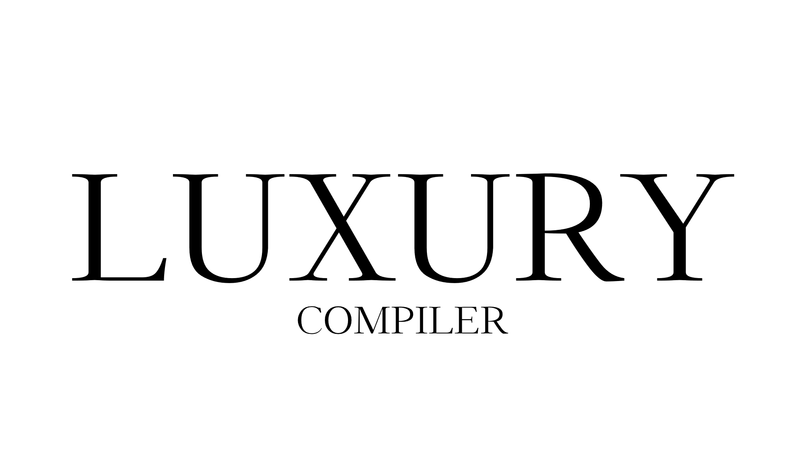

## Summary

Luxury is a statically programming langage which is targeting embedded programming. I will eventually stop using C and fully use this language instead. 
The compiler are a multipass compiler and are currently outputting x64 assembly code. I will eventually make a backend for ARMv7 including a compiler embedded linker.

## This is implemented (might change)

- type inference
- functions
- types (u8, s8, ...)
- nested block comments
- for loops
- while loops
- nested if statements
- assebly function (used in implementing syscalls)
- pointer math
- structures and unions
- typedefs
- position independence (it does not matter where something is declared)

## Credit

Thanks to Alex Taradov for inspiration and help.